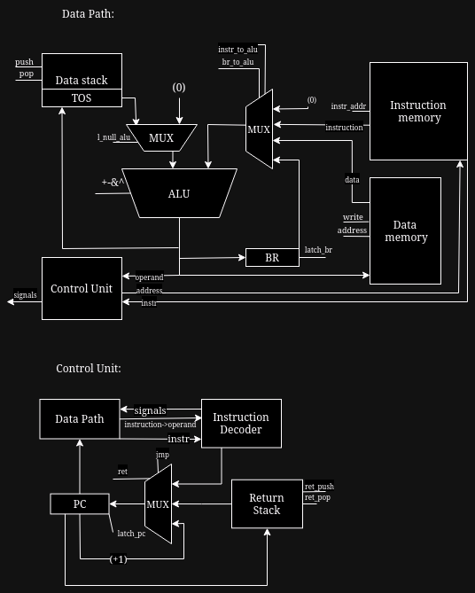

# Лабораторная работа №3 "Эксперимент"

## Вариант

- Сорокин Артём Николаевич. P3206

```
asm | stack | harv | mc -> hw | tick -> instr | struct | stream | mem | cstr | prob2 | cache
```

- Упрощенный вариант

### Расшифровка

- Ассемблер
- Стековая архитектура процессора
- Гарвардская архитектура памяти
- Hardwired
- Точность до инструкций
- Хранение кода как высокоуровневой архитектуры
- Потоковый ввод-вывод
- Порты ввода-вывода отображаются в память
- C-strings (длина + содержимое)
- Prob 2. Even Fibonacci numbers
- Кеш (***не реализован***)

## Содержание

- [Вариант](#вариант)
  - [Расшифровка](#расшифровка)
- [Содержание](#содержание)
- [ЯП](#яп)
  - [Синтаксис](#синтаксис)
  - [Семантика](#семантика)
  - [Типы аргументов](#типы-аргументов)
- [ISA](#isa)
  - [Формат инструкций](#формат-инструкций)
- [Память](#память)
- [Транслятор](#транслятор)
- [Модель процессора](#модель-процессора)
- [Статистика](#статистика)


## ЯП

### Синтаксис

Ассемблер:
```ebnf
<line> ::= <label> <comment>? "\n"
       | <instr> <comment>? "\n"
       | <comment> "\n"

<program> ::= <line>*

<label> ::= <label_name> ":"

<instr> ::= <op0>
        | <op1> " " <label_name>
        | <op1> " " <positive_integer>

<op0> ::= "nop"
      | "pop"
      | "inc"
      | "dup"
      | "swap"
      | "ret"
      | "hlt"

<op1> ::= "push"
      | "ld"
      | "st"
      | "add"
      | "sub"
      | "and"
      | "or"
      | "jl"
      | "jle"
      | "jmp"
      | "call"

```


### Семантика

Код выполняется последовательно, одна инструкция за другой.
Список доступных инструкций см. [ISA](#isa)

Метки определяются на отдельной строке исходного кода:

```asm
label:
        pop
```

Далее метки могут быть использованы (неважно, до или после определения) в исходном коде

```asm
label_addr:
        push label ; на вершине стека находится адрес на ячейку памяти pop
```

Метки не чувствительны к регистру. Повторное определение меток недопустимо.  
Определение меток `label` и `LaBeL` считается повторением.

Использовать определённую метку можно неограниченное число раз.  
Транслятор поставит на место использования метки
адрес той инструкции, перед которой она определена.

Любая программа обязана иметь метку `start`, указывающую начало программы.


### Типы аргументов

* `operand` - операнд (адреса, значения, метки)
* `none` - без операнда

## ISA


Особенности процессора:

* Машинное слово – не определено.
* Доступ к памяти осуществляется по адресу из специального регистра.
  Значение в нем может быть защелкнуто либо из `PC`, либо из вершины стека
* Обработка данных осуществляется в стеке. Данные попадают в стек из
  памяти, либо из устройств ввода/вывода.
* Поток управления:
  * Значение `PC` инкрементируется после исполнения каждой инструкции,
  * Условные (`JL`, `JLE`) и безусловный (`JMP`) переходы.

Набор инструкций:
```
NOP         none     - нет операции
SWAP        none     - меняет местами значения на стеке
PUSH        operand  - кладет значение на вершине стека
POP         none     - убирает значение с вершины стека
LD          operand  - загружает значение из памяти
ST          operand  - сохраняет значение в память
DUP         none     - дублирует значение на вершине стека
JMP         operand  - совершает безусловный переход по указанному адресу
JL          operand  - совершает условный переход по указанному адресу (если значение на вершине стека меньше 0)
JLE         operand  - совершает условный переход по указанному адресу (если значение на вершине стека меньше или равно 0)
CALL        operand  - вызывает подпрограмму
RET         none     - выходит из подпрограммы
INC         none     - увеличивает значение на стеке на 1
ADD         operand  - добавляет число
SUB         operand  - вычитает число
OR          operand  - операция ЛОГИЧЕСКОЕ ИЛИ
AND         operand  - операция ЛОГИЧЕСКОЕ И
HLT         none     - останавливает тактовый генератор
```

### Формат инструкций


Согласно [варианту](#вариант) машинный код хранится в высокоуровневой структуре. 
Это реализуется списком словарей (в python соответствуют `JSON` объектам).
Один элемент списка — это одна инструкция.
Инструкция представлена списком в виде индекса инструкции в списке, инструкцией, аргументом или пустой строкой в случае его отсутствия.
Индекс инструкции в списке – адрес этой инструкции в памяти команд.

Пример скомпилированной программы:
```json
{
  "code" :[
    [
      "0",
      "push",
      "3"
    ],
    [
      "1",
      "push",
      "4"
    ],
    [
      "2",
      "add",
      ""
    ],
    [
      "3",
      "st",
      "5"
    ]
    [
      "4",
      "pop",
      ""
    ],
    [
      "5",
      "hlt",
      ""
    ]
  ],
  "memory" :[
    [
      "3",
      "1"
    ],
    [
      "4",
      "2"
    ],
    [
      "5",
      "0"
    ]
  ]
}

```
Где:
* `memory` – память данных
* `code` - список инструкций

Система команд реализована в модуле [ISA](/isa.py).


## Память

* Вся внешняя память - статическая, SRAM
* Машинное слово – не определено. Инструкции хранятся в высокоуровневой структуре данных.
* Программа и данные хранятся в раздельной памяти согласно Гарвардской архитектуре. Программа состоит из набора инструкций, последняя инструкция – `hlt`.
* Адресация – прямая, абсолютная, доступ к словам.
* Доступ к памяти осуществляется по адресу c вершины стека


| address | content          |
| ------- | ---------------- |
| `00`    | `Input address`  |
| `01`    | `Output address` |
| `02`    | `Output number`  |
| ...     | ...              |
| `c+0`   | `Variable 1`     |
| ...     | ...              |

## Транслятор
Формат запуска: `./translator.py <input_file> <output_file>`
Реализован в [translator.py](/translator.py)
Компиляция осуществляется в 3 прохода по тексту программы:
- Проход по секции .data: преобразовывает данные в словарь переменная -> адрес в памяти данных.
- Первый проход по секции .text: получает словарь метка -> адрес в памяти команд.
- Второй проход по секции .text: подставляет все переменные и метки используя словари полученные на этапах выше.


## Модель процессора



Формат запуска: `./machine.py <machine_code_file> <input_file>`
### DataPath

Реализован в классе `DataPath`.
- `BR` - буферный регистр
- `Data Stack` - стек данных
- `Data Memory` - память данных
- `Instruction Memory` - память инструкций
- `TOS` - вершина стека
- `ALU` - арифметико-логическое устройство

Сигналы:
- `l_null_alu` - на левый вход `ALU` подается 0
- `push` - добавить значение на вершину `Data Stack`
- `pop` - извлечь значние с вершины `Data Stack`
- `write` - записать значение
- `address` - установить адрес памяти
- `instr_to_alu` - инструкция на правый вход `ALU`
- `br_to_alu` - значение `BR` на правый вход `ALU`
- `instr_addr` - установить адрес в `Instruction Memory`
- `latch_br` - защелкнуть `BR`

### ControlUnit

Реализован в классе `ControlUnit`

- `PC`-  Program counter, счетчик команд
- `Return Stack` - стек с адресами возвратов подпрограмм
- `Instruction Decoder` - интерпретатор машинных инструкций, если инструкция имеет операнд, то подается сигнал.

Сигналы:
-    `ret_push` - положить адрес возврата на `Return Stack`
-    `ret_pop` -  извлечь значение с вершины `Return Stack`
-    `ret` - извлечь из вершины `Return Stack` значение в `PC`
-    `jmp` - записать адрес в `PC`
-    `latch_pc` - защелкнуть `PC`


## Статистика
```text
| ФИО                         | алг        | LoC | code инстр. | инстр. | вариант                                                                |
| Сорокин Артем Николаевич | hello user | 51  | 28          | 413    | asm | stack | harv | hw | instr | struct | stream | mem | cstr | prob2 |
| Сорокин Артем Николаевич| cat        | 11  | 6          | 62    | asm | stack | harv | hw | instr | struct | stream | mem | cstr | prob2 |
| Сорокин Артем Николаевич | hello world| 17  | 10          | 110    | asm | stack | harv | hw | instr | struct | stream | mem | cstr | prob2 |
| Сорокин Артем Николаевич| prob2      | 42  | 29          | 83     | asm | stack | harv | hw | instr | struct | stream | mem | cstr | prob2 |
```
